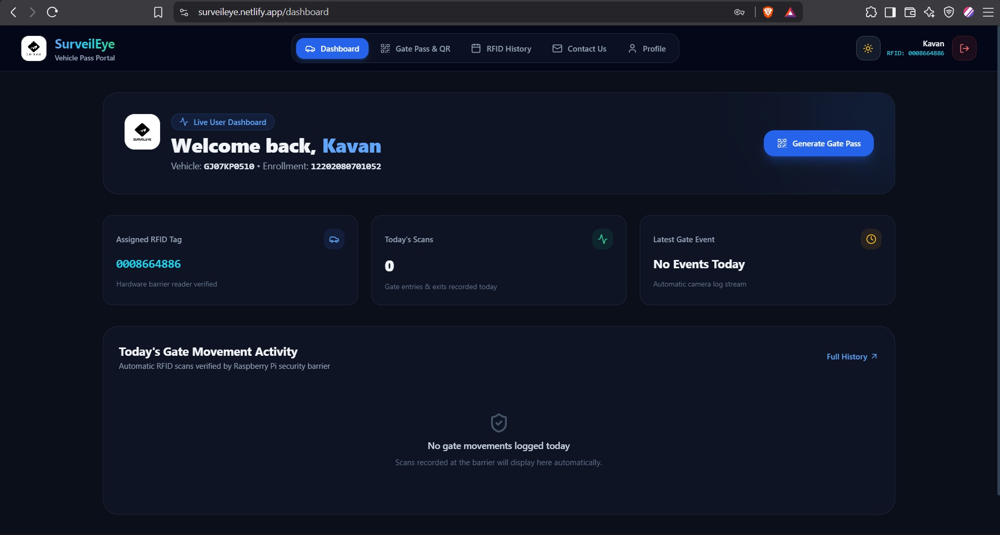
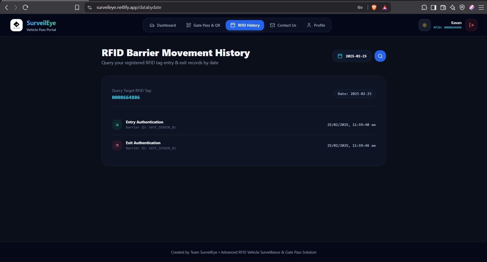
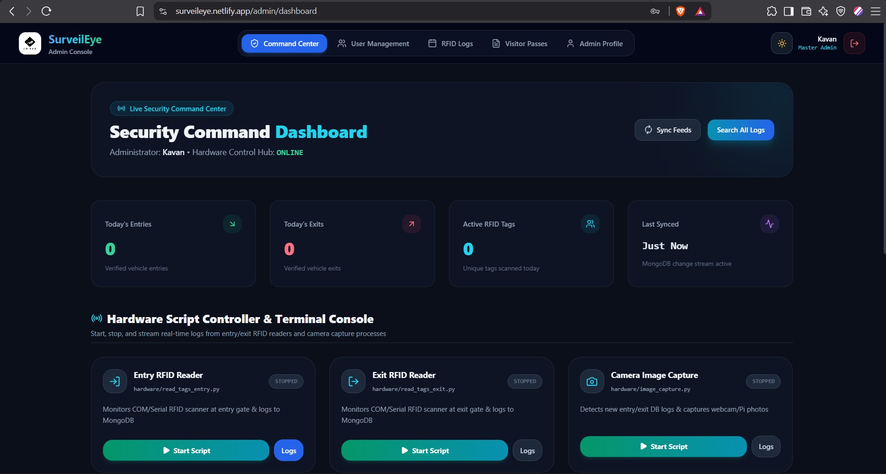
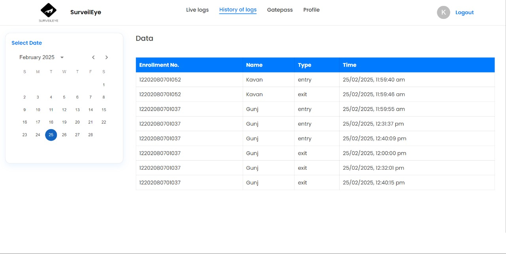
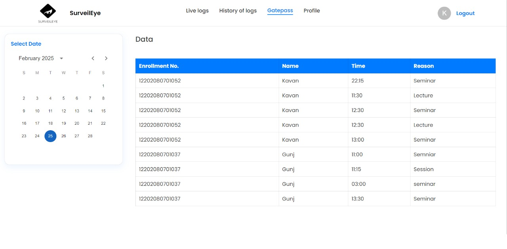

# 🚗 RFID-Based Vehicle Gate Pass & Surveillance System

An advanced **RFID & QR Code-based vehicle surveillance and security system** using **Raspberry Pi**. This project automates vehicle entry and exit monitoring with **RFID authentication**, **QR code-based visitor pass**, and **real-time surveillance with image capture**.

---

## ✨ Features
- **RFID-Based Access Control** – Registered vehicles enter via RFID authentication.
- **QR Code Visitor Pass** – Generates & scans QR codes for visitor entry.
- **Automated Gate Control** – Servo motors operate barricades upon successful verification.
- **Real-Time Logging** – Stores entry/exit logs in MongoDB.
- **Camera Surveillance** – Captures and stores entry/exit images for security.
- **Admin & User Panel** – Separate interfaces for users and administrators.
- **Secure Authentication** – Validates users before allowing access.

---

## 🏗 System Workflow
1. **RFID Entry**: Vehicle scans RFID tag → Verified against the database → Gate opens → Entry logged → Camera captures image.
2. **RFID Exit**: Vehicle scans RFID tag again → Exit logged → Gate opens.
3. **QR Code Entry**: Visitor requests a pass → QR code is generated and stored → QR code is scanned at entry → Verified → Gate opens → Entry logged → Camera captures image.
4. **QR Code Exit**: QR code is scanned again → Verified → Exit logged → Gate opens.

---

## 🔧 Tech Stack
- **Hardware**: Raspberry Pi, RFID Readers, Servo Motors, Camera Module, QR Code Scanner
- **Frontend**: React.js (User/Admin Dashboard)
- **Backend**: Node.js, Express.js
- **Database**: MongoDB
- **Authentication**: JWT (JSON Web Token)
- **Image Storage**: Locally stored entry/exit images

---

## 🚀 Installation & Setup
### 1️⃣ Clone the Repository
```sh
git clone https://github.com/your-username/rfid-gatepass-system.git
cd rfid-gatepass-system
```

### 2️⃣ Install Backend Dependencies
```sh
npm install
```

### 3️⃣ Set Up MongoDB & Environment Variables
- Configure `.env` file with necessary database credentials.

### 4️⃣ Start Backend Server
```sh
npm start
```

### 5️⃣ Start Frontend (React)
```sh
cd client
npm install
npm start
```

---

## 📸 Screenshots

### 🔹 User Dashboard  
  

### 🔹 User History Section  
  

### 🔹 Admin Dashboard  


### 🔹 Admin History Section  


### 🔹 QR Code Visitor Pass  
  

---

## 🛠 Future Enhancements
- 🔐 **Facial Recognition Integration** for enhanced security.
- 📡 **Cloud-Based Storage** for entry/exit images.
- 📊 **Real-time Admin Dashboard** with analytics & reports.
- 🛑 **Automatic Number Plate Recognition (ANPR)** integration.

---

## 📜 License
This project is open-source and available under the **MIT License**.

---

## 🤝 Contributing
Feel free to open issues and pull requests for enhancements!

---

## 👤 Created By

**Kavan Patel**  
🔗 [LinkedIn](https://www.linkedin.com/in/kavan-patel-763319251/)  
🌐 [Portfolio](https://kavanpatel.me)
